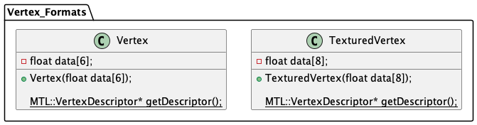

# GetIntoMetalDev, C++ edition!
## Part 10: Quality of Life refactor

Time to make a few changes
1. A first person camera class
1. Vertex formats are classes
1. Meshes are classes

This part is not incredibly conceptually important, just shuffling code around.
Basically, we'll write a bunch of classes. In each case we'll start with the spec and
then implement it.

### First person camera class

Here is the plan for our camera class:

rather than managing a collection of variables in our app, the camera is now its own class. The app can detect user input and then pass messages to update the camera. The app can also fetch the camera's view transform to use in rendering everything.

Implementation: model/camera

Usage: control/app

### Vertex Formats

Here are our vertex formats:

Underlined functions are static, these functions are scoped to the classes themselves rather than any particular instance.

What happened to the simd classes? In the previous stage we noted that attributes had some unusual padding, turns out that's caused by simd classes! Lumping all the numbers together lets us remove the padding completely.

Implementation: view/vertex_formats

Usage: view/mesh_factory, view/renderer

### Mesh Classes

A pretty straightforward abstraction, most importantly this hoists drawing code out of the renderer.

Implementation: view/mesh

Usage: view/mesh_factory, view/renderer

### Where to next?
Right now we've got a program with a first person camera and a textured quad. In the next part we'll write some code to load models. After that we should have all we need to make a simple project!