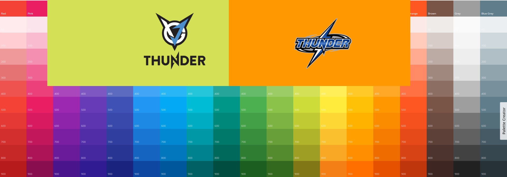
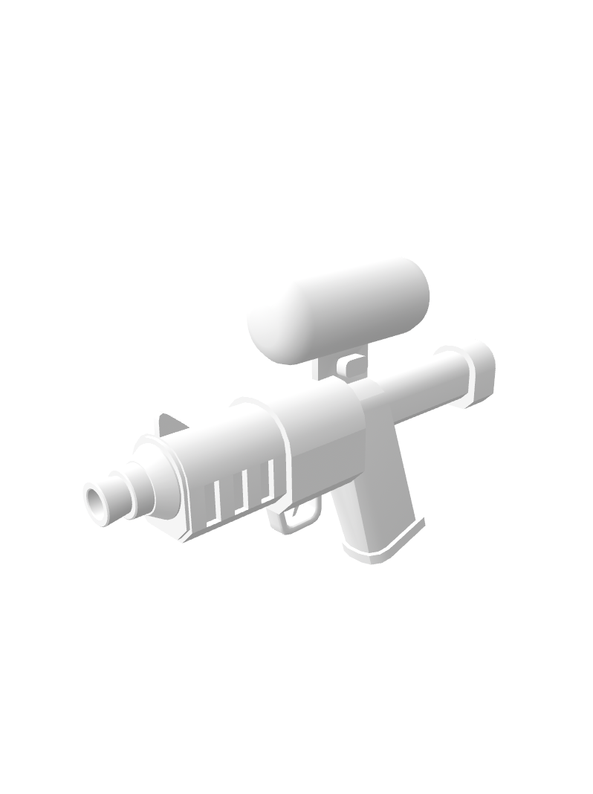
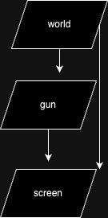
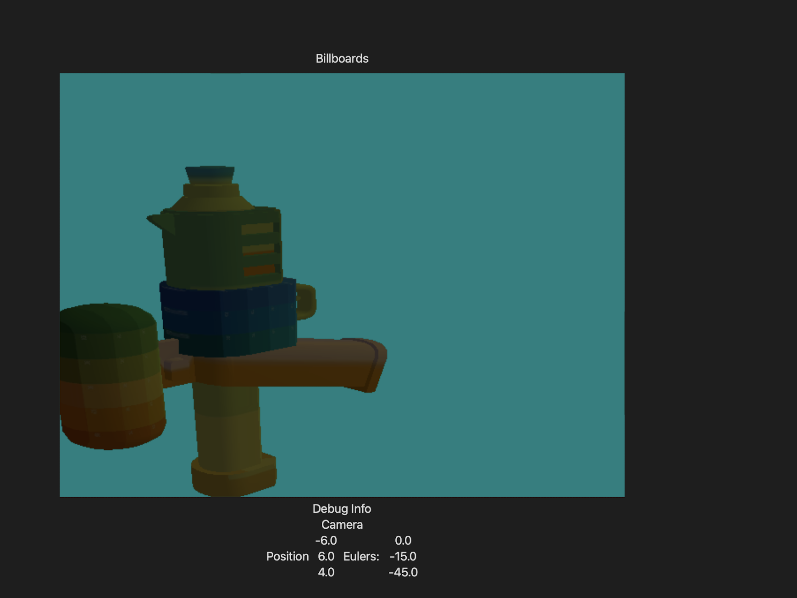
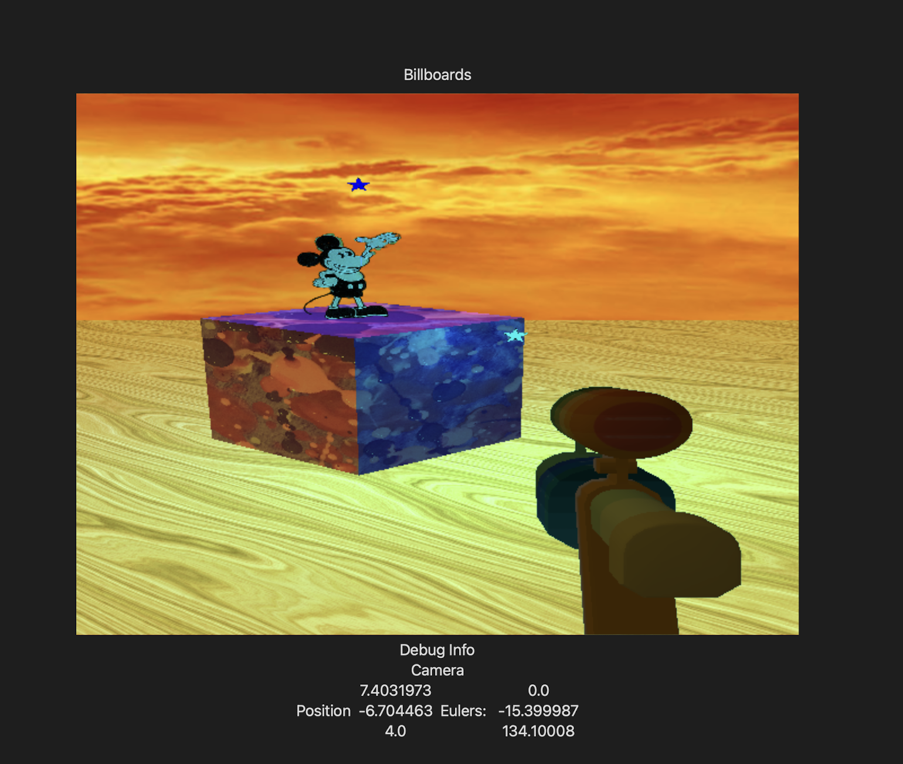

# Compositing Layers
Hello and welcome! Have you ever wondered how in FPS games the player's gun never pokes through walls? Some games use sophisticated solutions like limiting the player's movement so they don't get too close, or detecting wall distances so that the player puts down their gun to avoid this. But a lot of games will simply render the gun and world to independent textures then combine them. This seems like a cheap trick, and like most things in programming, it is! However it has the added benefit that the gun can sample from our view of the world, for things like screen space reflections, a zoomed view through the sniper lens, or even Halo's active camoflage effect.

For these reasons, I'll be investigating this technique.

## New Assets
In the provided project you'll see that I've included a new model and texture.





This will be used for our new gun. To make everything more visible let's remove the black and white post processing.

in postShaders:
```
fragment float4 fragmentShaderPost (
    FragmentPost input [[stage_in]],
    texture2d<float> screenTexture [[texture(0)]],
    sampler screenSampler [[sampler(0)]])
{
    return screenTexture.sample(screenSampler, input.texCoord);
}
```

## Render Layers
Our program is going to render to a number of layers, it will help to plan them out. Firstly, the whole world will be drawn to a worldLayer, then the gun will be drawn to a gunLayer, then both of those layers will be presented to the screen. 



We could combine then into a post processing layer, but I can't think of a post processing effect to apply so we'll keep it simple.

We'll go ahead and define the world and gun layers.

```
let worldLayer: RenderPass
let gunLayer: RenderPass
```

And then create them.
```
worldLayer = RenderPass(device: metalDevice,
                        width: 640, height: 480)
gunLayer = RenderPass(device: metalDevice,
                    width: 640, height: 480)
```

The renderpass class from previous sessions includes a color and depth buffer, so depth testing is enabled on those layers. We'll need to disable depth testing for the final bounce down to the screen though, we can do this is ContentView.

```
mtkView.framebufferOnly = true
mtkView.drawableSize = mtkView.frame.size
mtkView.isPaused = false
//mtkView.depthStencilPixelFormat = .depth32Float
```

We'll also need to modify the pipeline builder so it takes an argument to enable depth testing.
```
func BuildPipeline(vsEntry: String, fsEntry: String, depthEnabled: Bool = true) -> MTLRenderPipelineState {
        
    let pipelineDescriptor = MTLRenderPipelineDescriptor()
    // ...
    if depthEnabled {
        pipelineDescriptor.depthAttachmentPixelFormat = .depth32Float
    }

    // ...
}
```

## Drawing Functions
From a top level view, rendering a frame goes like this:

1. draw the world
1. draw the gun
1. draw the screen

To help with organization we'll break these out into individual functions.
```
func drawWorld(commandBuffer: MTLCommandBuffer) {
        
}

func drawGun(commandBuffer: MTLCommandBuffer) {
    
}

func drawScreen(commandBuffer: MTLCommandBuffer) {
    
}
```

## Drawing the World
This should be a simple task, since we've already implemented it. Drawing the world breaks down into the following subtasks:

1. Draw the sky
1. Draw the lit objects
1. Draw the emmissive (unlit) objects

All of these are copy-paste jobs.

We can view the results by rendering to the screen. Currently the top level renderer should look something like this:
```
func draw(in view: MTKView) {
        
    //update
    scene.update();
    
    guard let drawable = view.currentDrawable else {
        return
    }
    
    let commandBuffer = metalCommandQueue.makeCommandBuffer()!
    
    drawWorld(commandBuffer: commandBuffer)
    
    drawScreen(commandBuffer: commandBuffer, view: view)
    
    commandBuffer.present(drawable)
    commandBuffer.commit()
}
```

## Drawing the Gun
The gun will take a little more work, but not much. The world is based around instanced rendering, which might be overkill for just a single model. Let's make a general function to draw a model. The good news is that we only need to modify our vertex shader and can reuse our fragment shader!

Here's the original shader:

```
vertex Fragment vertexShaderGun(
        const device Vertex *vertices [[ buffer(0) ]],
        unsigned int vid [[vertex_id]],
        unsigned int iid [[ instance_id ]],
        const device InstancePayload *payloads [[ buffer(1) ]],
        constant CameraParameters &camera [[ buffer(2) ]])
{
    
    Fragment output;
    Vertex vertex_in = vertices[vid];
    output.position = camera.projection * camera.view * payloads[iid].model * vertex_in.position;
    output.texCoord = vertex_in.uv;
    output.normal = float3(payloads[iid].model * float4(vertex_in.normal, 0.0));
    output.cameraPosition = camera.position;
    output.fragmentPosition = float3(payloads[iid].model * vertex_in.position);
    output.materialID = payloads[iid].color_texID.w;
    
    return output;
}
```

We won't need the per instance payloads or instance id. Will we need a model transform though? Interesting question, there are a few ways we could approach this. The simplest is to create a pre-transform, apply it once on model loading and then render the gun in the camera's frame of reference, ie. screen space. In this specific case, though, there are some issues.

* Models are beiing loaded in a loop, so we would either need to apply an identity pre-transform to models, or set a default value and then load the gun separately.
* Lights are defined in world space, not screen space
* Not every model is rendered in screen space, making a general world space vertex shader is a pretty solid decision for futureproofing.

With that in mind, let's take in a model transform.

```
vertex Fragment vertexShaderGun(
        const device Vertex *vertices [[ buffer(0) ]],
        unsigned int vid [[vertex_id]],
        constant matrix_float4x4 &model [[ buffer(1) ]],
        constant float &materialID [[ buffer(3) ]],
        constant CameraParameters &camera [[ buffer(2) ]])
{
    
    Fragment output;
    Vertex vertex_in = vertices[vid];
    float4 worldPos = model * vertex_in.position;
    output.position = camera.projection * camera.view * worldPos;
    output.texCoord = vertex_in.uv;
    output.normal = float3(model * float4(vertex_in.normal, 0.0));
    output.cameraPosition = camera.position;
    output.fragmentPosition = float3(worldPos);
    output.materialID = materialID;
    
    return output;
}
```

Now let's compile the shader, first, define it.
```
#define PIPELINE_TYPE_GUN 4
```

Then build it.
```
pipelines[PIPELINE_TYPE_LIT] = pipelineBuilder.BuildPipeline(
    vsEntry: "vertexShader", fsEntry: "fragmentShader")
pipelines[PIPELINE_TYPE_GUN] = pipelineBuilder.BuildPipeline(
    vsEntry: "vertexShaderGun", fsEntry: "fragmentShader")
// ...
```

We can now start working on the drawing function.

```
func drawGun(commandBuffer: MTLCommandBuffer) {
    let renderEncoder = commandBuffer.makeRenderCommandEncoder(
        descriptor: gunLayer.renderpassDescriptor)
    renderEncoder?.setDepthStencilState(gunLayer.depthStencilState)
    
    // Arm shader for drawing
    
    // Send data to shader
    
    // Draw the gun
    
    renderEncoder?.endEncoding()
}
```

Arming the shader is simple enough.
```
// Arm shader for drawing
renderEncoder?.setRenderPipelineState(pipelines[PIPELINE_TYPE_GUN]!)
```

Unfortunately, although we previously sent a lot of this data already, it does need to be rebound for each renderpass encoder. Fortunately, we can copy-paste it.

```
renderEncoder?.setRenderPipelineState(pipelines[PIPELINE_TYPE_GUN]!)
renderEncoder?.setDepthStencilState(gunLayer.depthStencilState)
renderEncoder?.setVertexBuffer(menagerie.vertexBuffer, offset: 0, index: 0)
renderEncoder?.setFragmentTexture(materialLump.texture, index: 0)
renderEncoder?.setFragmentSamplerState(materialLump.sampler, index: 0)

sendCameraData(renderEncoder: renderEncoder)

sendLightData(renderEncoder: renderEncoder)
```

We can then send the new info.
```
let scale = float4x4(
    [0.1, 0, 0, 0],
    [0, 0.1, 0, 0],
    [0, 0, 0.1, 0],
    [0, 0, 0, 1]);

let translation = Matrix44.create_from_translation(translation: scene.player.position + scene.player.forwards);
        
var model = translation * scale;
renderEncoder?.setVertexBytes(&model, length: MemoryLayout<float4x4>.stride, index: 1);

var materialID = Float32(OBJECT_TYPE_GUN);
renderEncoder?.setVertexBytes(&materialID, length: MemoryLayout<Float32>.stride, index: 3);
```

To draw, we use the vertex lump to query our offsets.
```
renderEncoder?.drawPrimitives(type: .triangle,
                            vertexStart: Int(menagerie.firstVertices[OBJECT_TYPE_GUN]!),
                            vertexCount: Int(menagerie.vertexCounts[OBJECT_TYPE_GUN]!))
```

And of course, adjust the drawScreen function to draw the gun layer as well.
```
// World
// ...
        
// Gun
renderEncoder?.setFragmentTexture(gunLayer.colorBuffer, index: 0)
renderEncoder?.setFragmentSamplerState(gunLayer.colorBufferSampler, index: 0)

renderEncoder?.drawPrimitives(
    type: .triangle,
    vertexStart: 0,
    vertexCount: 6
)
```

## Tweaks (and now the real fun begins)
If we run the program now we get something... interesting

*"Interesting" is subjective*

The camera is mostly correct, we can tweak that later. What's concerning is that the gun layer has completely covered the world layer with its clear color, which has an alpha of 1. We can change this easily enough in the RenderPass:
```
renderpassDescriptor.colorAttachments[0].clearColor = MTLClearColorMake(0, 0.5, 0.5, 0.0)
```

We then just need to tweak the gun's position.

```
let scale = float4x4(
    [0.1, 0, 0, 0],
    [0, 0.1, 0, 0],
    [0, 0, 0.1, 0],
    [0, 0, 0, 1]);

let pitch = Matrix44.create_from_rotation(eulers: [90 - scene.player.eulers[1], 0, 0]);

let yaw = Matrix44.create_from_rotation(eulers: [0, 0, 90 + scene.player.eulers[2]]);

let translation = Matrix44.create_from_translation(translation:
    scene.player.position + scene.player.forwards - 0.1 * scene.player.right - 0.4 * scene.player.up);

var model = translation * yaw * pitch * scale;
```

And there we have it, that mouse had better watch out!
