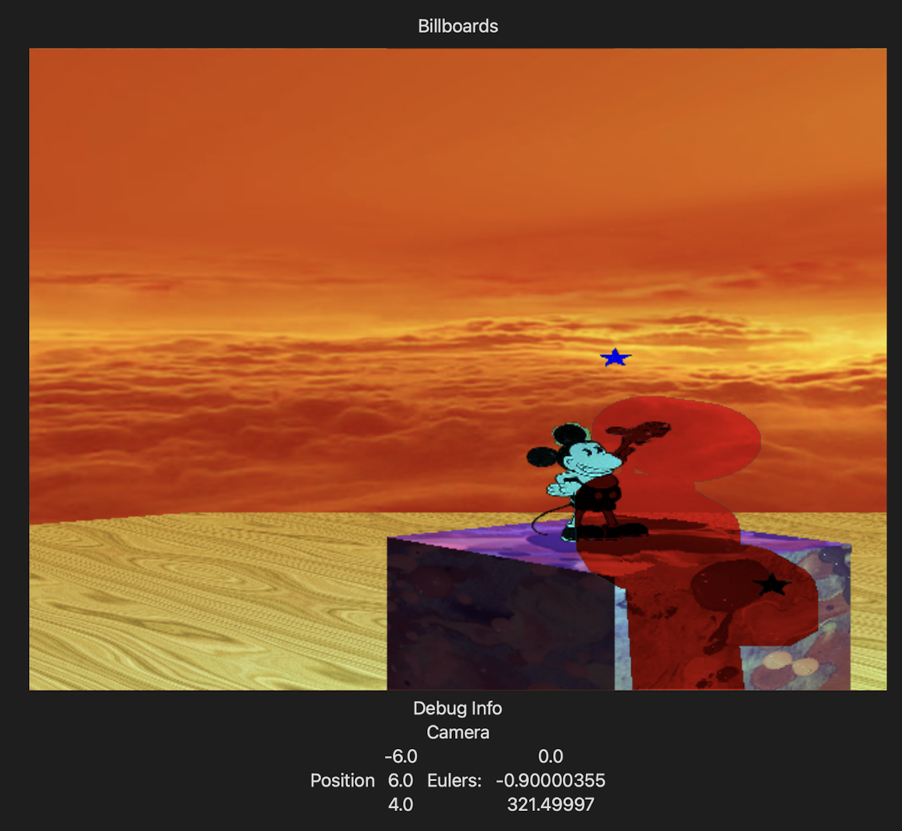
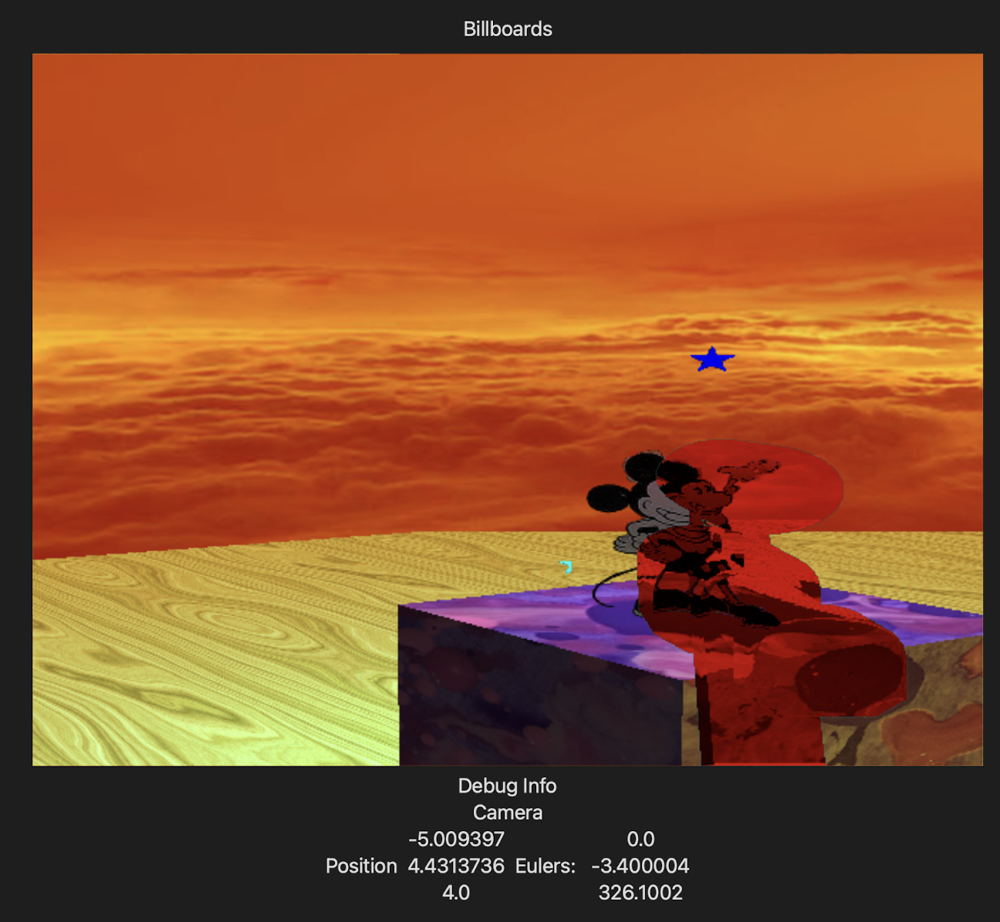

# Glass Gun
In the previous tutorial we rendered the world and gun to independent layers and then overlaid them. This time, let's use the view of the world in rendering a see-through gun.

## Vertex Payload
The pipeline will now be quite a bit simpler, we will set the clip-space position, and then find the texture coordinates based on that. The texture coordinate will be the (adjusted) position of the fragment on the screen.

in Shaders:
```
struct GunFragment {
    float4 position [[position]];
    float2 texCoord;
};
```

## Vertex Shader
The vertex shader gets a little simpler. We find the clip space position and use that for the tex coordinates also.

```
vertex GunFragment vertexShaderGun(
        const device Vertex *vertices [[ buffer(0) ]],
        unsigned int vid [[vertex_id]],
        constant matrix_float4x4 &model [[ buffer(1) ]],
        constant CameraParameters &camera [[ buffer(2) ]])
{
    Vertex vertex_in = vertices[vid];
    float4 clipSpacePos = camera.projection * camera.view * model * vertex_in.position;
    GunFragment output;
    output.position = clipSpacePos;
    // Apply perspective division, then map to [0,1] range
    float x = 0.5 * (1.0 + clipSpacePos.x / clipSpacePos.w);
    float y = 0.5 * -(1.0 + clipSpacePos.y / clipSpacePos.w);
    output.texCoord = float2(x,y);
    
    return output;
}
```

## Fragment Shader
The fragment shader needs to be redone, the basic idea is to just sample from the world layer. For now we'll tint the world red.

```
fragment float4 fragmentShaderGun(
    GunFragment input [[stage_in]],
    texture2d<float> worldTexture [[texture(0)]],
    sampler worldSampler [[sampler(0)]])
{
    return float4(1, 0, 0, 1) * worldTexture.sample(worldSampler, input.texCoord);
}
```

## Drawing the gun
Almost nothing needs to change, we just bind the world layer so our shader can sample from it.

```
func drawGun(commandBuffer: MTLCommandBuffer) {
    
    // ...
    renderEncoder?.setFragmentTexture(worldLayer.colorBuffer, index: 0)
    renderEncoder?.setFragmentSamplerState(worldLayer.colorBufferSampler, index: 0)
    // ...
}
```


## Approximate Refraction
The gun now looks like a simple transparent material, we can add to the realism by displacing the texture coordinates. The rough idea is that the x and y components of the normal will "warp" the ray of light passing through the gun.

```
vertex GunFragment vertexShaderGun(
        const device Vertex *vertices [[ buffer(0) ]],
        unsigned int vid [[vertex_id]],
        constant matrix_float4x4 &model [[ buffer(1) ]],
        constant CameraParameters &camera [[ buffer(2) ]])
{
    Vertex vertex_in = vertices[vid];
    float4 clipSpacePos = camera.projection * camera.view * model * vertex_in.position;
    GunFragment output;
    output.position = clipSpacePos;
    // Normal warps the texture coordinates!
    float4 normal = camera.projection * camera.view * model * float4(vertex_in.normal,0);
    clipSpacePos = clipSpacePos + 0.2 * normal;
    // Apply perspective division, then map to [0,1] range
    float x = 0.5 * (1.0 + clipSpacePos.x / clipSpacePos.w);
    float y = 0.5 * -(1.0 + clipSpacePos.y / clipSpacePos.w);
    output.texCoord = float2(x,y);
    
    return output;
}
```

